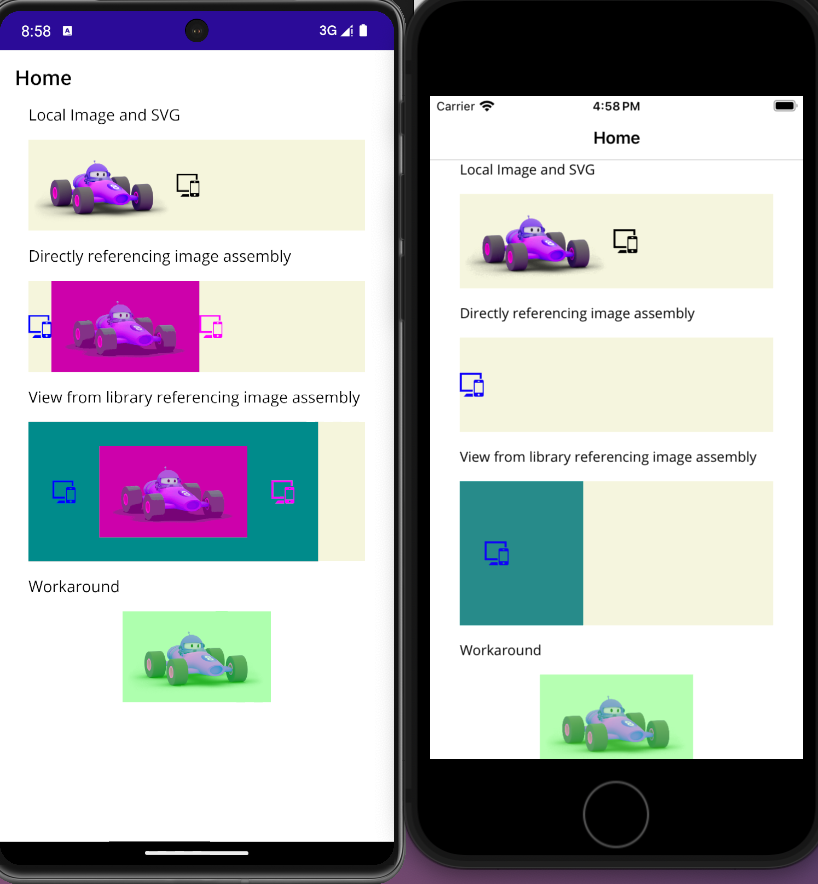

# .NET MAUI iOS Unable To Load Image File Issue

This is a project to isolate an issue with .NET MAUI's images across several projects. 

Inside of the project, there are three projects representing a sample project:

### MauiImageLibrary

Represents a library whose intention is to provide images.

Isolated from any other code, all this project contains is a PNG and an SVG image. They are tinted magenta.


### MauiViewLibrary

This is an example library that consumes resources from `MauiImageLibrary` to create a View named `ImagesView`. It has a dark cyan background. 

It also has its own SVG that is referenced in `ImagesView`, tinted blue. 


### TestMaui

The main maui application references `MauiViewLibrary` and implicitly references `MauiImageLibrary`. 

It also has two untinted images used as a basis for loading images into the project, which work on either platform. 

It creates three groups:

- One layout with the png and svg in the local project
- One layout referencing `MauiViewLibrary` and `MauiImageLibrary`'s image assets
- One layout referencing `MauiViewLibrary` for the `ImagesView` that it creates


## Result

- Android System: Pixel 7 Pro UpsideDownCake, arm64-v8a
- maui-android 8.0.6/8.0.100 SDK 8.0.200
- iOS System: iPhone SE (3rd generation) iOS 17.2
- maui-ios 8.0.6/8.0.100 SDK 8.0.200

On the left, you can see the Android application. On the right, iOS. 


As you can see on the screenshot, Android displays the views as expected, but iOS fails to find the images. The console also displays a related issue: 

```
System.InvalidOperationException: Unable to load image file.
   at Microsoft.Maui.FileImageSourceService.GetImageAsync(IFileImageSource imageSource, Single scale, CancellationToken cancellationToken)
```

This only seems to happen when one of the libraries references the other. `MauiViewLibrary` did not reference `MauiImageLibrary`, the images would load successfully when directly referenced by `TestMaui`. 

